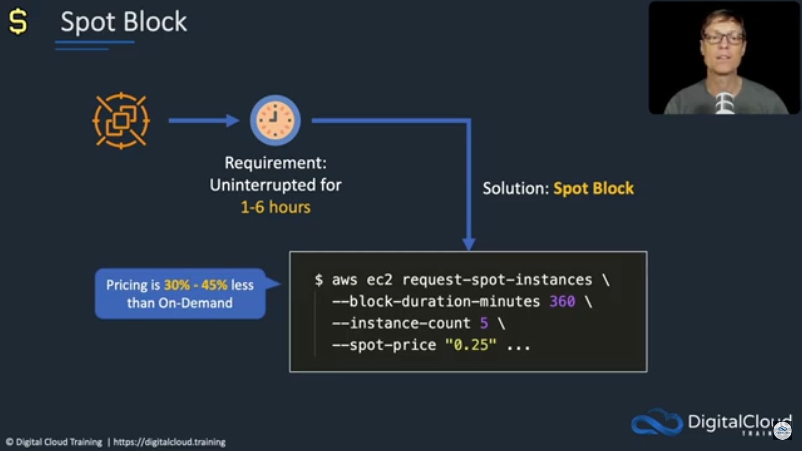

---
aliases:
---

# **EC2 Sizing & Configuration**

- **Operating System (OS):** Choose between Linux, Windows, or macOS.
- **Compute Power & Cores (CPU):** Determine the CPU capacity and number of cores required.
- **Random-Access Memory (RAM):** Specify the amount of RAM needed for optimal performance.
- **Storage Space:**
    - **Network-attached:** Utilize options such as Elastic Block Store (EBS) and Elastic File System (EFS).
    - **Hardware:** Consider storage options provided by EC2 Instance Store.
- **Network Card:** Configure the network card speed and obtain a Public IP address for connectivity.
- **Firewall Rules:** Define security group settings to manage inbound and outbound traffic.
- **Bootstrap Script (Configure at First Launch):** Leverage EC2 User Data to execute scripts or commands during initial setup.
## **EC2 Instance Types**

- AWS offers a variety of EC2 instance types optimized for diverse use cases.
    - AWS follows a specific naming convention for its services and resources.
        - m5.2xlarge
            - **m:** instance class
            - **5:** generation (AWS improves them over time)
            - **2xlarge:** size within the instance class

🗣️ The different EC2 types are:

1. General Purpose
2. Compute Optimized
3. Memory Optimized
4. Accelerated Computing
5. Storage Optimized
6. HPC Optimized
7. Instance Features
8. Measuring Instance Performance

### **EC2 Instance Types - General Purpose**

- Great for **diverse workloads like web servers and code repositories**
- Balances:
    - Compute
    - Memory
    - Networking resources effectively

### **EC2 Instance Types - Compute Optimized**

- Ideal for **compute-intensive tasks demanding high-performance processors**
- Suitable for:
    - Batch processing workloads
    - Media transcoding
    - High-performance web servers
    - High-performance computing (HPC)
    - Scientific modeling and machine learning
    - Dedicated gaming servers

### **EC2 Instance Types - Memory Optimized**

- Provides fast performance for workloads **processing large data sets in memory**
- Suitable for:
    - High-performance relational/non-relational databases
    - Distributed web-scale cache stores
    - In-memory databases optimized for business intelligence (BI)
    - Applications performing real-time processing of large unstructured data

### **EC2 Instance Types - Storage Optimized**

- Ideal for **storage-intensive tasks with high, sequential read and write access to large data sets on local storage**
- Suitable for:
    - High-frequency online transaction processing (OLTP) systems
    - Relational and NoSQL databases
    - Cache for in-memory databases (e.g., Redis)
    - Data warehousing applications
    - Distributed file systems

---
## Amazon EC2 Pricing Options:

- Amazon EC2 offers **various purchasing options to suit different workload requirements and budgetary considerations.**
    1. On-Demand Instances
    2. Reserved Instances
    3. Savings Plans
    4. Spot Instances
    5. Dedicated Hosts
    6. Dedicated Instances
    7. Capacity Reservations

### **EC2 Purchasing Options - On-Demand Instances**

- **Pay-as-you-go model with no long-term commitments.**
- Ideal for applications with unpredictable workloads or short-term projects.
- Offers **flexibility to start and stop instances as needed without upfront payments or long-term contracts.**
- **Use cases:**
    - **Variable Workloads:** Ideal for unpredictable usage patterns or fluctuating workloads.
    - **Development and Testing:** Well-suited for temporary environments without long-term commitments.
    - **Short-Term Projects:** Quickly provision instances for short-term initiatives or projects.

### **EC2 Purchasing Options - Reserved Instances**

- Reserved capacity for **a specific instance type in a selected region.**
    - **72% discount compared to on-demand**
    - You reserve a specific instance attributes (Instance Type, Region, Tenancy, OS)
- Options for **1-year or 3-year terms**.
- Suitable for applications with **steady-state workloads or predictable usage patterns.**
- **Use cases:**
    - Ideal for applications with steady-state usage patterns.
    - **Capacity Planning:** Enables organizations to secure reserved capacity in advance for anticipated workloads, ensuring resource availability when needed.

### **EC2 Purchasing Options - Savings Plans**

- Flexible pricing model offering savings on compute usage across EC2 instances, AWS Lambda, and Fargate.
    - Provides significant discounts compared to On-Demand rates, with **the flexibility to choose between different commitment options.**
- Ideal for **workloads with consistent usage or those requiring flexibility in instance types and sizes.**

### EC2 Purchasing Options - Spot Instances

- Bid on unused EC2 capacity, allowing access to spare compute capacity at reduced rates.
- Offers the potential for **significant cost savings,** sometimes up to 90% compared to On-Demand prices.
- Suitable for **fault-tolerant applications, batch processing, or workloads with flexible start and end times.**
- **Use cases:**
    - Useful for workloads that are resilient to failure
    - Batch jobs
    - Data analysis
    - Image processing

### **EC2 Purchasing Options - Dedicated Hosts**

- Physical servers dedicated to a single customer's use, providing **isolation and control over instance placement**.
- Offers compliance and regulatory requirements by ensuring instances run on dedicated infrastructure.
- Ideal for applications with licensing restrictions or regulatory constraints.
- **Use cases:**
    - **Sensitive data:** for example, in an organization that handles sensitive patient data subject to strict regulatory requirements; to ensure compliance and data security, the organization opts for dedicated hosts to run its electronic record system.
    - Use your eligible software licenses from vendors such as Microsoft and Oracle.

### **EC2 Purchasing Options - Dedicated Instances**

- Dedicated Instances **provide physical servers exclusively dedicated to a single customer's use.**
    - Enhanced security and isolation for sensitive workloads.
    - Predictable performance
    - Ideal for applications with **strict compliance or licensing requirements**
- May share hardware with other instances in same account
- No control over instance placement (can move hardware after Stop / Start)
- Use cases:
    - **Storing sensitive data that cannot be interrupted - banking institutions, for example!**

### **EC2 Purchasing Options - Capacity Reservations**

- Capacity reservations **allow users to reserve capacity for specific instance types in a selected AWS Availability Zone.**
- Provides guaranteed capacity availability for instances within the reserved capacity pool.
    - Offers flexibility to launch instances within the reservation as needed, ensuring resource availability for critical workloads.
- Capacity reservations can be purchased for On-Demand instances, Reserved Instances, or Savings Plans, providing various pricing options and cost-saving opportunities.
- **Use cases:**
    - Ideal for organizations requiring **predictable performance and capacity assurance for mission-critical applications or workloads.**

---

## **How to choose EC2 Purchasing Options**

1. **Define Workload Requirements**
    - Identify the **specific requirements of your workload**, including compute, memory, storage, and networking needs.
2. **Analyze Performance Characteristics**
    - Evaluate the **performance characteristics of different EC2 instance types, such as CPU performance, memory size, and network performance.**
3. **Consider Cost Optimization**
    - Assess the **cost implications of different instance types**, taking into account On-Demand pricing, Reserved Instances, Savings Plans, and spot instance options.
4. **Review Use Case Suitability**
    - Explore the **various EC2 instance families available, such as General Purpose, Compute Optimized, Memory Optimized, Storage Optimized, etc.**
5. **Evaluate Instance Families**
    - Conduct testing and benchmarking to validate the performance and suitability of selected EC2 instance types for your workload before deployment.
6. **Monitor and Optimize**
    - Continuously monitor EC2 instance performance and usage metrics to identify optimization opportunities and make adjustments as needed to meet evolving workload requireme