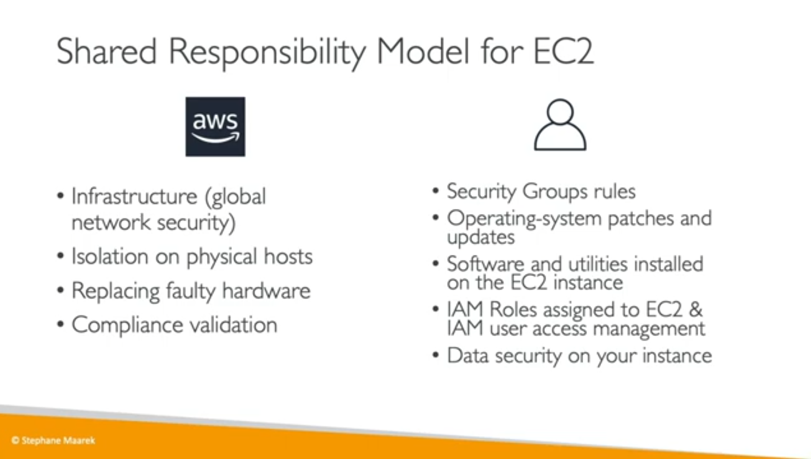

# Shared Responsibility Model for EC2

## Security in EC2

- **Security Groups are essential for network security in AWS.**
    - They manage **inbound and outbound traffic** for EC2 Instances.
- Security Groups consist solely of **rules.**
- Rules within Security Groups **can specify permissions by IP address or by referencing other Security Groups.**

## EC2 Instances: Information

- **Security groups serve as a "firewall" for EC2 instances.**
    - **They regulate:**
        - Access to specific ports
        - Authorized IP ranges for both IPv4 and IPv6
        - Control of inbound traffic (from others to the instance)
        - Control of outbound traffic (from the instance to others)
- Can be attached to **multiple instances.**
- Restricted to a specific region and VPC combination.
- Operates **externally to the EC2 instance; blocked traffic does not reach the instance.**
- Advisable to maintain **a separate security group** specifically for SSH access.
    - If your application times out and is not accessible, it's likely a security group configuration issue.
- If you receive a "connection refused" error, the issue may be with the application itself or it may not have been started.
    - By default, **all inbound traffic is blocked.**
    - By default, **all outbound traffic is allowed.**

### Useful Ports You Should Know:

🗣️ Please note: this is good information to know, but you won’t be tested on these ports during your exam!

- **22: SSH (Secure Shell) -** used for logging into a Linux instance. - **21: FTP (File Transfer Protocol) -** used for uploading files to a file share. - **22: SFTP (Secure File Transfer Protocol) -** used for securely uploading files via SSH. - **80: HTTP -** used for accessing unsecured websites. - **443: HTTPS -** used for accessing secured websites. - **3389: RDP (Remote Desktop Protocol) -** used for logging into a Windows instance.

## **Elastic Block Store (EBS) Volumes**

- An EBS (Elastic Block Store) Volume is **a network drive that can be attached to instances while they run.**
    - It allows instances to persist data even after termination.
    - At the CCP level, they can **only be mounted to one instance at a time.**
- EBS volumes are bound to **a specific availability zone.**
- They can be thought of as a **"network USB stick."**
    - The free tier includes 30 GB of free EBS storage of type General Purpose (SSD) or Magnetic per month.
- EBS (Elastic Block Store) is a **network drive, meaning it's not a physical drive and uses the network to communicate with the instance, which may result in some latency.**
    - It can be detached from one EC2 instance and attached to another quickly.
    - EBS volumes are locked to an Availability Zone (AZ); for example, a volume in us-east-1a cannot be attached to an instance in us-east-1b.

## **EBS Volumes**

- To move a volume across AZs, you **need to create a snapshot first.**
- EBS volumes have a provisioned capacity, measured in GBs and IOPS (Input/Output Operations Per Second).
    - Billing is based on the provisioned capacity, regardless of usage.
    - The capacity of the drive can be increased over time.

## **Delete on Termination Attribute**

- Controls the EBS behaviour when **an EC2 instance terminates**
    - By default, the root EBS volume is deleted (attribute enabled)
    - By default, any other attached EBS volume is not deleted (attribute disabled)
- This **can be controlled by the AWS console / AWS CLI**
- Use case: preserve root volume when instance is terminated

## EBS

- Create **a backup (snapshot) of your EBS volume at a specific point in time.**
- It's not necessary to detach the volume to take a snapshot, but it's recommended for consistency.
    - Snapshots can be copied across Availability Zones or Regions.
    
**EBS Snapshots Features**

- **EBS Snapshot Archive**
    - Move a Snapshot to an ”archive tier” that is 75% cheaper Takes within 24 to 72 hours for restoring the archive
- **Recycle Bin for EBS Snapshots**
    - Setup rules to retain deleted snapshots so you can recover them after an accidental deletion Specify retention (from 1 day to 1 year)

## **Amazon Machine Image (AMI)**

- **Amazon Machine Image (AMI)** = customization of an EC2 instance
    - Can add your own software, configuration, operating system, monitoring…
- Speedier boot / configuration time because all your software is pre-packaged
- AMI are built for a specific region (and can be copied across regions)
- You can launch EC2 instances from:
    - **A Public AMI:** AWS provided
    - **Your own AMI:** you make and maintain them yourself
    - **An AWS Marketplace AMI:** an AMI someone else made (and potentially sells)
- Start an EC2 instance and customize it according to your needs.
    - Stop the instance to ensure data integrity before creating an image.
    - Build an AMI (Amazon Machine Image) from the stopped instance, which will also create EBS snapshots.
    - Launch new instances using the custom AMI or other available AMIs.

## **EC2 Instance Store**

- **EBS volumes are network drives that offer good but "limited" performance.**
- For high-performance hardware disks, use EC2 Instance Store, which provides better I/O performance.
- EC2 Instance Store volumes are ephemeral, meaning they lose their storage if the instance is stopped.
- They are suitable for buffer, cache, scratch data, or temporary content.
- There is a risk of data loss if the hardware fails.
- Managing backups and replication is your responsibility.

## **EFS - Elastic File System**

- **Managed NFS (network file system)** that can be mounted on 100s of EC2
    - EFS works with Linux EC2 instances in multi-AZ
    - Highly available, scalable, expensive (3x gp2), pay per use, no capacity planning

_**EFS Infrequent Access (EFS-IA)**_

- **EFS Infrequent Access (EFS-IA)** is a storage class optimized for cost, designed for files not accessed daily.
- Offers up to **92% lower cost compared to EFS Standard.**
- EFS automatically moves files to EFS-IA based on the last access time.
- Enable EFS-IA with a Lifecycle Policy, such as moving files not accessed for 60 days to EFS-IA.
- The transition to EFS-IA is transparent to applications accessing EFS.

## **Amazon FSx: Managed File Storage**

- **FSx for Windows File Server:**
    - Managed Windows-native file system.
    - Supports SMB protocol and Microsoft Active Directory.
- **FSx for Lustre:**
    - High-performance file system for compute-intensive workloads.
    - Integrates with Amazon S3 for data storage.
- **Key Features:**
    - High performance, scalability, built-in backups.
    - Integration with AWS services.