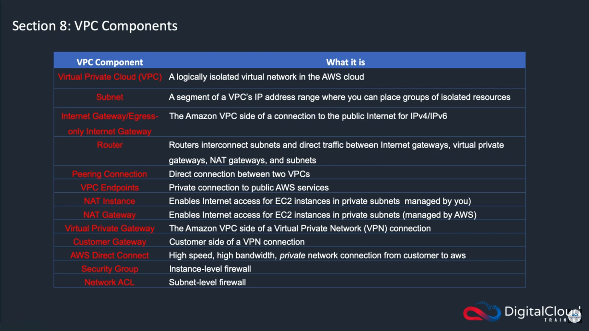

Virtual Private Cloud: An Introduction

In this section, you'll be introduced to Virtual Private Cloud (VPC) in AWS, understanding its role in creating isolated virtual networks within the cloud environment. You'll explore the benefits of VPC, including enhanced security, network customization, and the ability to seamlessly extend your on-premises infrastructure into the cloud. By the end, you'll grasp the fundamental concepts of VPC and its importance in building scalable and secure cloud architectures.

# **Virtual Private Cloud: An Introduction**

## **Introduction to VPC & Subnets**

- **VPC** = Virtual Private Cloud; **private network** to deploy your resources **(regional resource)**
- **Subnets** = allow you to partition your network inside your VPC (Availability Zone resource)
    - **A public subnet** is a subnet that is accessible from the internet
    - **A private subnet** is a subnet that is not accessible from the internet
- To define access to the internet and between subnets, we use **route tables**.

### **IP Addresses in AWS - useful information!**

🗣️ This is useful information for your knowledge; but you won’t be tested on this!

- **Public IPv4: Usable on the internet.** - Each EC2 instance is assigned a new public IPv4 address upon every stop-start cycle by default. - **Private IPv4: Used within private networks (LAN), such as internal AWS networks (e.g., 192.168.1.1).** - Private IPv4 addresses remain constant for EC2 instances, even when stopped and restarted. - **Elastic IP: Provides a static public IPv4 address that can be associated with an EC2 instance.** - Pricing: AWS charges $0.005 per hour for all public IPv4 addresses, including Elastic IPs. - Free Tier includes 750 hours of usage per month. - **IPv6 – Internet Protocol Version 6 (Approximately 340 Undecillion Addresses)** - All IP addresses are public in AWS (there are no private ranges). - Example Address: 2001:db8:3333:4444:cccc:dddd:eeee:ffff - No charge for usage.

## **Internet Gateway & NAT Gateways**

- **Internet Gateways =** enable internet connectivity for instances in a VPC.
- **Public Subnets =** are configured with a route to the Internet Gateway for external access.
- **NAT Gateways (managed by AWS) and NAT Instances (managed by the user)** provide internet access to instances in Private Subnets while keeping them private.

### **Network ACL & Security Groups**

- **NACL (Network Access Control List):**
    - Acts as a firewall controlling traffic to and from a subnet.
    - Supports both ALLOW and DENY rules.
    - Attached at the subnet level.
    - Rules are based solely on IP addresses.
- **Security Groups:**
    - A firewall that controls traffic to and from an Elastic Network Interface (ENI) or an EC2 instance.
    - Only ALLOW rules are supported.
    - Rules can include IP addresses and other security groups.

---

VPC Connections

Explore VPC connections, including options for connecting your VPC to other AWS services, on-premises data centers, and remote networks. You'll learn about VPN connections, Direct Connect, VPC peering, and AWS Transit Gateway, understanding the benefits and considerations of each connectivity option. By the end, you'll have a comprehensive understanding of how to establish and manage connections to and from your VPC, ensuring seamless communication across your hybrid cloud environment.

# **VPC Connections**

## **VPC Peering**

- **VPC Peering allows two VPCs to connect privately using AWS' network**
    - Making them behave as if they were in the same network.
- It requires that the VPCs have non-overlapping CIDR blocks (IP address ranges).
- VPC Peering connections are not transitive; a direct connection must be established for each pair of VPCs that need to communicate.

## **VPC Endpoints**

- **VPC Endpoints enable private network connections to AWS services, bypassing the public internet for enhanced security and lower latency.**
- VPC Endpoint Gateway is used for S3 and DynamoDB (which we will cover later in the course!)
- VPC Endpoint Interface is used for other AWS services.

## **AWS PrivateLink (VPC Endpoint Services)**

- **AWS PrivateLink is the most secure and scalable way to expose a service to thousands of VPCs without requiring VPC peering, internet gateways, NAT devices, or route tables.**
- It requires a Network Load Balancer (NLB) in the service VPC and an Elastic Network Interface (ENI) in the customer VPC.

## **Site to Site VPN**

- **Site-to-Site VPN:**
    - Connects an **on-premises VPN to AWS.**
    - The connection is **automatically encrypted.**
    - Traffic goes over the **public internet.**
    - On-premises: **must use a Customer Gateway (CGW)
    - AWS: must use a Virtual Private Gateway (VGW)**

## **Direct Connect**

- Establishes a **physical connection between on-premises and AWS.**
    - The connection is private, secure, and fast.
    - Traffic goes over a private network.
    - Takes at least a month to establish.

## **AWS Client VPN**

- **AWS Client VPN (using OpenVPN):**
    - Allows you to connect from your computer to your private network in AWS and on-premises.
    - Enables you to connect to your EC2 instances over a private IP, as if you were in the private VPC network.
    - The connection goes over the public internet.

## **Transit Gateway**

- Provides **transitive peering between thousands of VPCs and on-premises networks using a hub-and-spoke (star) connection.**
- Utilizes a single gateway to offer this functionality.
- Compatible with Direct Connect Gateway and VPN connections.