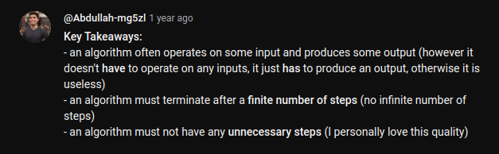
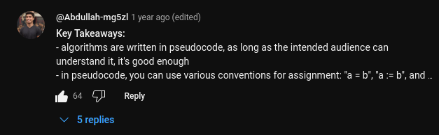

# Algorithms
## 1.1 What is Algorithm?
- Algorithm is a finite sequence of well-defined instructions for solving a problem.

## 1.2 Charaacteristics of Algorithm
- Input
- Output
- Finiteness
- Definiteness
- Effectiveness

### Input
- Input is the information that is supplied to the algorithm for processing.
- Algorithm can have zero or more inputs.
### Output
- Output is the information that is produced by the algorithm.
- Algorithm should have at least 1 output.
### Finiteness
- A finite sequence of well-defined instructions for solving a problem.
- Algorithm should terminate after a finite number of steps.
### Definiteness
- Each step in the algorithm must be clear and unambiguous.
### Effectiveness
- Each step in the algorithm must be carried out effectively.
- You shouldn't write unneccessary steps.
- What ever steps you write, it should do something in the procedure.

### Key Takeaways:


## 1.3 How to write and analyze an algorithm?
### 1.3.1 How to write an algorithm?
- Write the algorithm in a natural language (English)
``` jsx
 -  store value of a in variable x
 -  change the value of a to be b
 -  change the value of b to be x
```
- Write the algorithm in a pseudocode
``` jsx 
swap(a, b)
begin 
  x <-- a // store value of a in variable x
  a <-- b // change the value of a to be b
  b <-- x // change the value of b to be x

end

```
- Write the algorithm in a programming language

``` php 

function swap($a, $b){
    $x = $a;
    $a = $b;
    $b = $x;
    return $a, $b;
};
```
### 1.3.2 How to analyze an algorithm?
- Time Complexity
- Space Complexity
- N/W
- Power Consumption
- CPU Usage (CPU Register)

### ---Time Analysis for pervious example
- **every statement in the algorithm takes 1 unit of time.**
``` php 

function swap($a, $b){
    $x = $a; // take 1
    $a = $b; // take 1
    $b = $x; // take 1
    return $a, $b; // take 1
    // so the total time is 3 unit of time.
    // t(n) = 3
    // o(1) ===> which indicates that the time is constant.
};
```
- **Note That: When We Write a mathmatical equation , the time unit is depend on the problem. let me give you an example.**
``` 

x = 5 * a + 6 * b ===> here it will takes 4 unit of time.
```
### --- Space Analysis for pervious example
- **every variable in the algorithm takes 1 unit of space.**
``` php
function swap($a, $b){
    $x = $a; // take 1
    $a = $b; // take 1
    $b = $x; // take 1
    return $a, $b; 
    // so the total space is 3 unit of space.
    // s(n) = 3
    // o(1) ===> which indicates that the space is constant.
}
```

## Key Takeaways:
