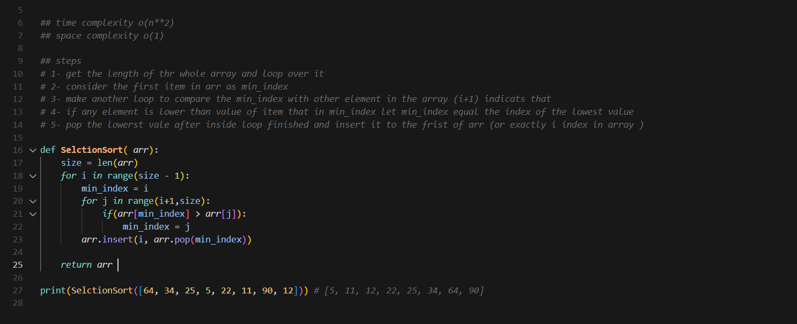

---

#  Chapter 2

## How Memory Works : 

imagine you need to store your things in a chest of drawer. each drawer can hold only one element. so if you have a child toy and your phone for example you'll need to store them into two drawers. this is basically how your computer memory works. you ask your computer for a space to store your data. and your computer gives you the address of your drawer which could be like this `f0ff00xa` .

## Difference Between Array and LinkedList : 

#### Array:
###### **Cons:**
using an array to store data has many cons like it store items of the array contiguously in the memory meaning if you have 6 items in array they should be stored next each other in memory. the problem comes when there is only 5 free addresses and no seat for the sixth item. here you should find another free 6 seats which could be difficult and really slow your application.

###### **Pros:**
also it has many pros that make it more common than LinkedList like it allow sequential access and random access while LinkedList allow sequential access only. sequential access means that in order to access the 4th element you need to go over first three elements to reach it. while array provide access to element instantly which called random access.
#### LinkedList:

###### **Pros:**
it's called LinkedList because you link many addresses in different places in memory meaning that you haven't to store items next to each other like arrays. you can store each element in different place but you should reference for the next item and this reference contains the address of this item in memory. and it's very fit choice when you want to insert or delete item because it has `o(1)` runtime at insert and delete operations unlike reading which has a `o(n)` and array could be better at reading 

###### **Cons:**
LinkedList also has many cons like if you want to reach to the 4th element you should read first the first three elements. on another way LinkedList provides only sequential access which means that you can not access the 4th element direct without going on first three elements unlike array which provides you both sequential and random access. LinkedList reading time is `o(n)` while array is `o(1)` 

## Selection Sort

the idea of selection sort is that you loop over the desired array and get the index of the lowest item and pop it and append it in a new array like following code 

# Chapter 3
